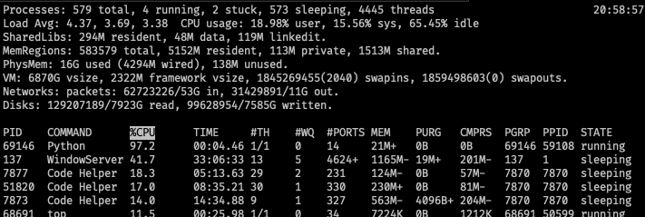

### Exercise 01: How to save in File-System disk/your computer

Create a folder with any name where you can keep your text data or comma separated csv data or any other kind of data. There are different data access mode like read(`r`), write(`w`), append(`a`), open file with read and write(`r+`). Use encoding "utf-8" also to save data and built-in function `open()`.

The pseudo-code for this exercise may look something like the snippet below:

```
variable_name = open(files/filepath, mode="w", encoding="utf-8")
variable_name.write(data/text to save)
variable_name.close()

```

- You may check the result by opening file from files folder

###

### Exercise 02: How read data from File-System disk/your computer

Read the contents of the file provided in `src/files/data.txt`. Print the results in your terminal using Python. The mode="r" can be used when reading the file.

- Your result should look like this:

```
Welcome to DCI tutorials for file create and read
```

###

### Exercise 03: How to create and store json object to a file

- Create a variable called `student_data` which which hold a dictionary with a name and role like this: `student_data = { "name": "Arif", "role": "teacher" }`
- Convert this dictionary to a JSON string using the `dumps()` method from the `json` module.
- Save the output in to a JSON file (with an extension: `example.json`).

###

### Exercise 04: How to Read json data

- Open the existing json data file in the read mode (`r`).
- Print the data to the screen.

- Your result may be look like that:

```
{"name": "arif", "role": "teacher"}
```

### Dependencies for Exercises 5 and 6.

Please install the dependecies for some of the utility functions to run

`pip install -r requirements.txt`

### Exercise 05: How to update a CSV based file

In this exercise, execute a helper function we have written to write new content to a file.

`python helper.py --task make-csv --file task_5.csv --rows 100`

Try this with different number of rows so your program can take a longer time to run for example, 2000 rows.

Profile the CPU usage of your computer as you run the instructions below. Keep checking on the statistics to know if the computer can really handle all this load.
In Linux (and Mac), the command `top` can be used in the terminal to determine the CPU usage as you run scripts below.



- Write a Python script to update the name of the person found in the 1000'th row of the CSV file, `customers.csv`.

- Run the program that reads the file `customers.csv`, while it is running, attempt to run another Python script to edit the item in the 1000'th row? Is it possible to do this? This attempts can be done on different tabs in your terminal.

The command to read the content of the `customers.csv` file and print to screen using our helper module is:

`python helper.py --task read-csv --file customers.csv --users 10`

Options:

`--users`: Use this option to refer to number of users trying to access the same file.

`--task`: Refers to the name of the task, currently `read-csv` and `make-csv` are the only tasks supported.

`--file`: Refers to a file name of an existing file located relative to the Python script.

Bonus points (optional): For the curious, explore this https://github.com/sachinrekhi/richtextpy repository for an idea on how one might implement a multi-edit solution like Collaborative editing that is provided by Google docs for example.
